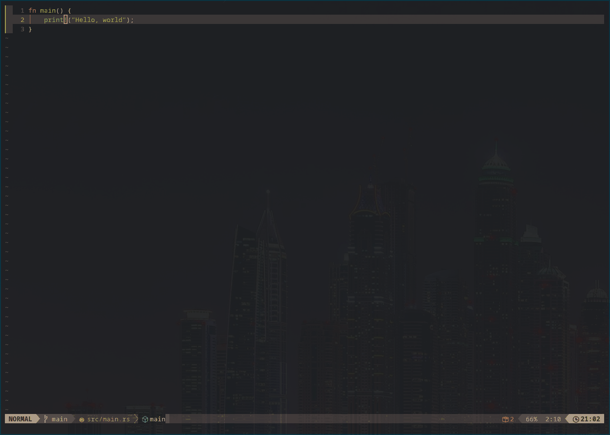

# gwatch.nvim



This is a small nvim plugin which uses [gwatch](github.com/operdies/gwatch) to watch for file events, 
and write the stdout to a buffer. The exact behavior can currently only be controlled per filetype.

The UI is heavily borrowed from [sniprun.nvim](https://github.com/michaelb/sniprun).

I am personally loading this with [LazyVim](https://github.com/LazyVim/LazyVim).
Below is a config with some example configuration.

The primary motivation for this plugin is to automatically do something when I update a source file.

```lua
{
  "Operdies/gwatch.nvim",
  keys = {
    { "<leader>ct", '<cmd>lua require("gwatch").toggle()<cr>', desc = "Toggle Gwatch", mode = "n" },
    { "<leader>cs", '<cmd>lua require("gwatch").start()<cr>', desc = "Start Gwatch", mode = "n" },
    { "<leader>cx", '<cmd>lua require("gwatch").stop()<cr>', desc = "Stop Gwatch", mode = "n" },
  },
  opts = {
    -- The width of the UI window
    windowWidth = 50,
    -- Options in this block are the default independent of language
    default = {
      -- Check the output of `gwatch --help` for specific information about flags
      eventMask = "write",
      mode = "kill",
      patterns = "**",
      -- %e and %f respectively expand to the event, and the file it affected
      command = "echo %e %f",
    },
    -- Settings for a specific filetype override default settings
    lang = {
      go = {
        patterns = { "**.go", "go.mod" },
        -- Not using 'go run .' because that doesn't return the actual running process PID.
        -- gwatch will be unable to kill spawned instances of the process.
        command = "go build -o ./out .; ./out",
      },
      rust = {
        patterns = { "**.rs", "Cargo.toml" },
        command = "cargo run",
      },
    },
  },
}
```
